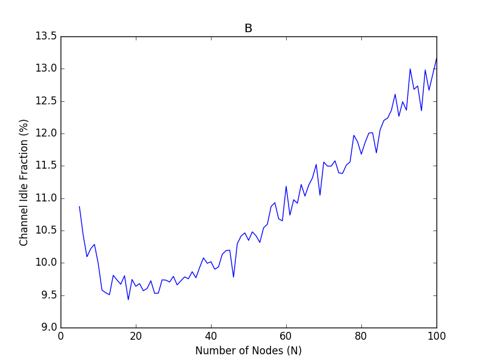
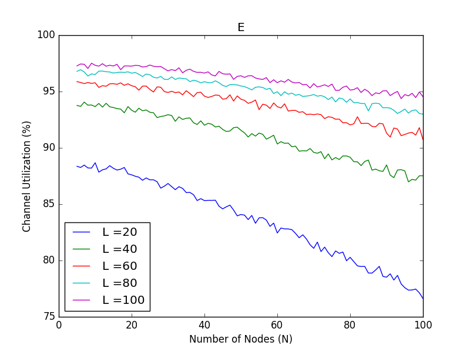

# ece438-mp4

## How To Run
```
python3 csma.py input.txt
```

For an output.txt such as:

```
Channel utilization (in percentage) 87.0
Channel idle fraction (in percentage) 9.712
Total number of collisions 1644
Variance in number of successful transmissions (across all nodes) 307.6
Variance in number of collisions (across all nodes) 212.2464

```

For graphs:

```
pip install -r requirements.txt
python3 mp4_graphs.py
```
## Part 3

### A

### B

### C

### D

### E

### F
Both graphs follow the general trend set by Figure A, as the number of nodes increase, channel utilization decreases. Due to more nodes fighting for the same channel, it's much more likely for collisions to happen, thus decreasing utilization time.

Increasing R is shown to decrease channel utilization more drastically at a lower amount of nodes. This makes sense as there would be fewer collisions at lower amounts of nodes, thus a lower range will have a lower idle time. A larger range will decrease collisions, however the channel will remain idle as nodes count down from the larger back off values. This seems to be the general pattern when we increase the range, however things get weird at higher amounts of nodes. R = 16 significantly outperforms both R = 4 and R = 8, which both seem to converge on a single utilization. Overall this signals a more complex tradeoff in R, between time spent in collision and time spent idle.

Increasing L is shown to increase channel utilization, due to the obvious observation that the channel isn't idle as a node transmits a packet and thus less clock cycles will be spent for nodes fighting to get the channel.