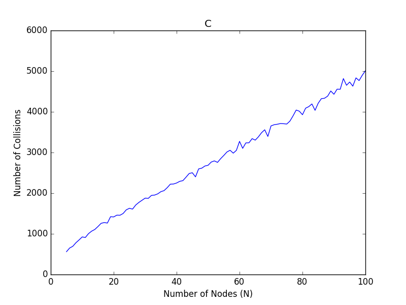
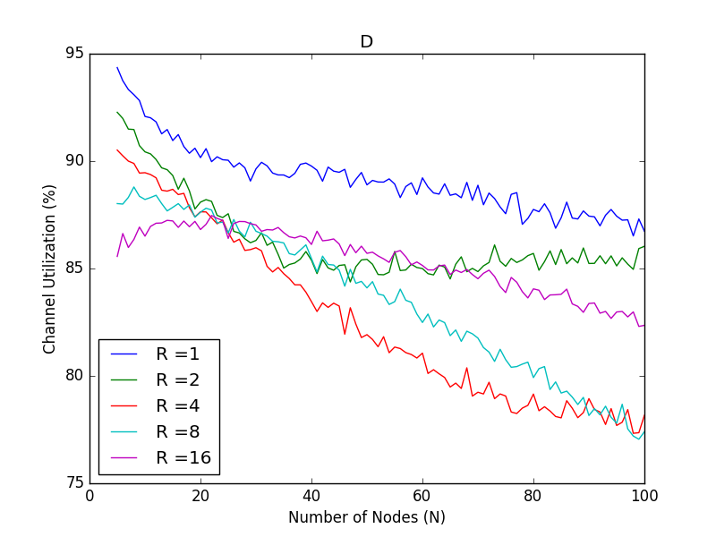

# ece438-mp4

## How To Run
```
python3 csma.py input.txt
```

For an output.txt such as:

```
Channel utilization (in percentage) 94.858
Channel idle fraction (in percentage) 5.142
Total number of collisions 1941
Variance in number of successful transmissions (across all nodes) 431.7856
Variance in number of collisions (across all nodes) 89.11
```

For graphs:

```
pip install -r requirements.txt
python3 mp4_graphs.py
```
## Part 3

### A

### B

### C

### D

### E

### F
Both graphs follow the general trend set by Figure A, as the number of nodes increase, channel utilization increases. Due to more nodes fighting for the same channel, it's much more likely for the channel to be utilized by one of them as backoff values will be more uniform.

Increasing R is shown to decrease channel utilization, more drastically at a lower amount of nodes. A larger range will decrease collisions, however the channel will remain idle as nodes count down from the larger back off values. As the number of nodes increase, there becomes a more uniform distribution in back off values and thus channel utilization will steadily increase.

Increasing L is shown to increase channel utilization, due to the obvious observation that the channel isn't idle as a node transmits a packet and thus less clock cycles will be spent for nodes fighting to get the channel. Increasing the  number of nodes increases the possibility that a node will be transmitting a packet, thus utilizing the channel.